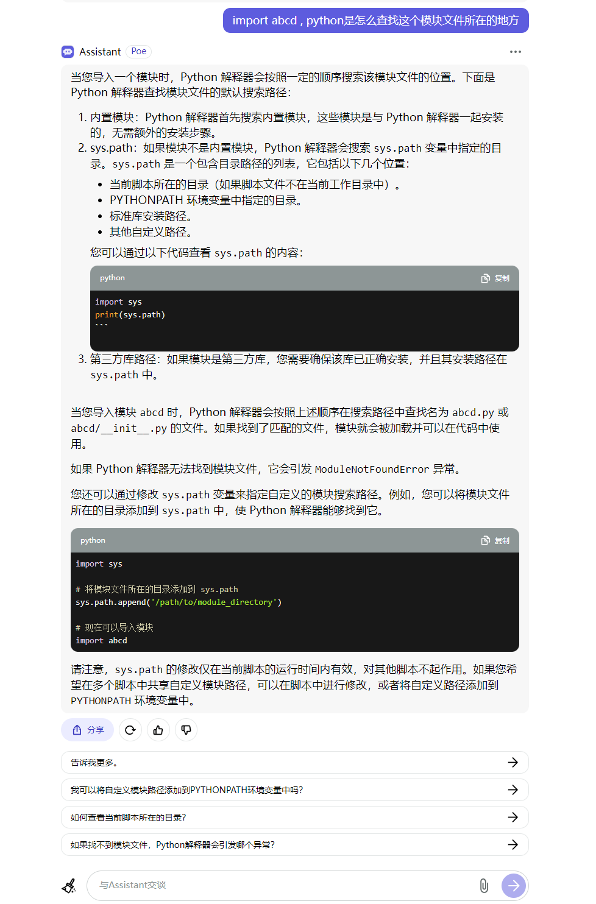
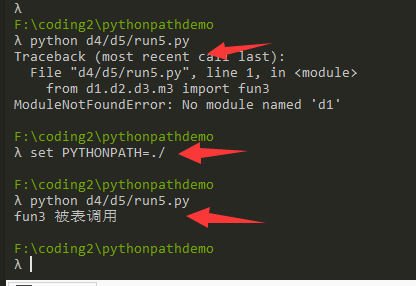
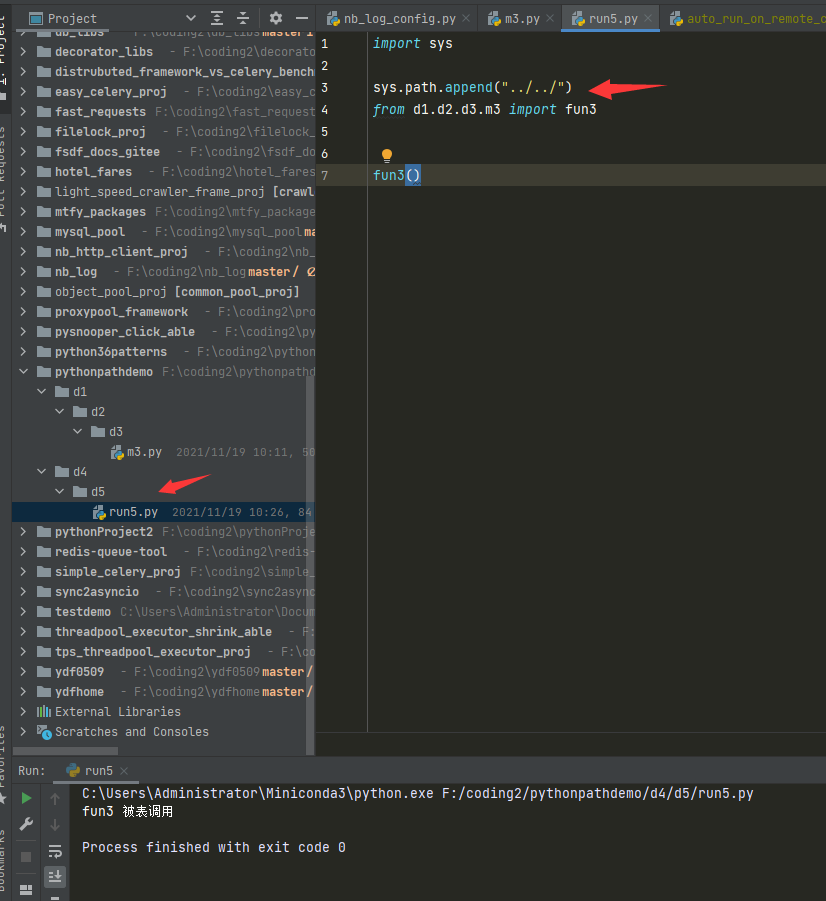
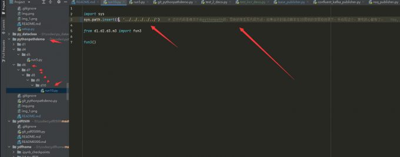
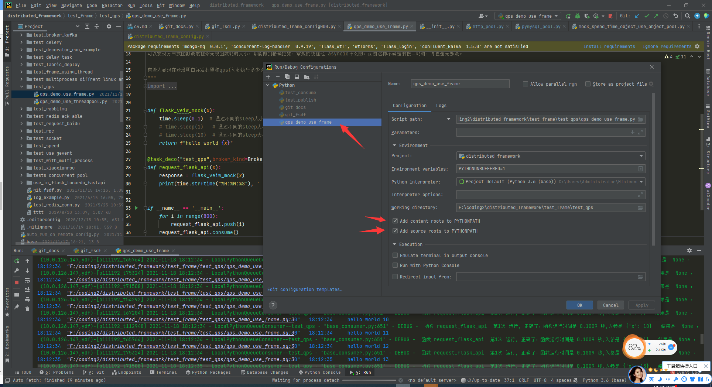
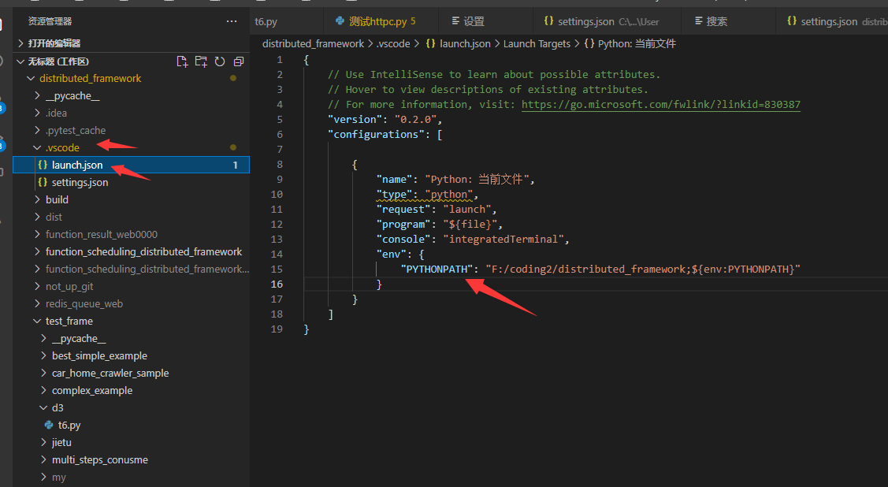

https://www.bilibili.com/video/BV1p3DVY6E5A

# 用一个python项目文件夹结构说明掌握 PYTHONPATH作用的重要性

这个readme要认真看，里面说明了pythonath的作用，

第1章 解释了python 中 import 一个模块,python是怎么个查找顺序的。python import abcd,是从哪里去找abcd这个包或模块的。
https://bic-berkeley.github.io/psych-214-fall-2016/sys_path.html

第2、3 章 说明了为什么复杂深层级项目的代码在pycharm导入和运行完美，在cmd或者vscode shell下import不到导致报错的例子。在pycahrm运行run5.py正确调用fun3函数，在cmd命令行却不行，vscode也不行。因为Pycharm 可以通过Alt + Enter（visual studio快捷键下），自动导入包。主要原因是pycahrm自动把项目根目录加到了 PYTHONPATH，如下图你把这两个勾选去掉就pycahrm运行run5.py也会和cmd命令行一样报错。

第6章还重点解释了永久性环境变量和临时环境变量的重大影响范围的区别

第7章说明了任何项目如果设置了 PYTHONPATH 的4大好处
安装pyenv解决对python环境管理上的难点，轻松地在多个版本的 Python 之间切换并自动配置环境变量。提供对每个项目的 Python 版本的支持https://github.com/pyenv/pyenv
pyenv作者直接声明Windows系统都不算服务器servers，Pyenv 不正式支持 Windows，并且不能在 Linux 的 Windows 子系统之外的 Windows 中运行。此外，即使在那里，它安装的 Python 也不是本地 Windows 版本，而是在虚拟机中运行的 Linux 版本 - 因此您将无法获得特定于 Windows 的功能。

不要在Windows系统安装GitHub上依赖python之类需要编译的软件，会有一大堆依赖报错。

第9章说明了设置 PYTHONPATH 达到多个项目复用公司公共工具类代码的妙用

## 其他 PYTHONPATH文章
[环境变量：PYTHONPATH](https://cloud.tencent.com/developer/article/1473765)
[See the Python 3 docs for PYTHONPATH.](https://bic-berkeley.github.io/psych-214-fall-2016/using_pythonpath.html)
[官网讲pythonpath](https://docs.python.org/3/using/cmdline.html#envvar-PYTHONPATH)

## 1.0 先了解下python 中 import 一个模块,python是怎么个查找顺序的

很多pythoner到现在不清楚python  import abcd,是从哪里去找abcd这个包或模块的,连 PYTHONPATH 是什么都从来没听说过,

这种简单常识问题如果不想百度,那就问chatgpt就好了.



## 1.项目目录说明
```
pythonpathdemo是这个项目的根目录，
d1/d2/d3/m3.py  有一个fun3函数，
d4/d5/run.py 里面导入和运行fun3函数
，这种目录的python项目就很容易验证懂PYTHONPATH的重要性了。
```

## 2. 演示pyachrm完美运行，cmd和vscode报错


截图可以看出，在pycahrm运行run5.py正确调用fun3函数，在cmd命令行却不行，vscode也不行。

主要原因是pycahrm自动把项目根目录加到了 PYTHONPATH，如下图你把这两个勾选去掉就pycahrm运行run5.py也会和cmd命令行一样报错。


## 3. 演示在cmd命令行设置local environment临时会话环境变量 PYTHONPATH 后运行完美或者设置 Virtual Environment（virtualenv、Conda、pyenv）

如果在cmd窗口会话中临时设置PYTHONPATH、javapath、phppath等为项目根目录再运行run5.py就不会报错了。
不要愚蠢的去硬编码 sys.path.insert或者append
注意要在代码运行前临时设置环境变量，不要设置永久固定系统环境变量，因为你不可能只有一个python项目，一般每个人最少有七八个python项目吧。
Java虚拟环境（JVM），Java 的 JDK 多版本管理（JEnv、SDKMAN、Jabba）
如果在vscode插件扩展市场安装了Red Hat“Language support for Java ™ for Visual Studio Code”报错“Java 23 or more recent is required to run the Java extension. Please download and install a recent JDK. You can still compile your projects with older JDKs by configuring ['java.configuration.runtimes'](https://github.com/redhat-developer/vscode-java/wiki/JDK-Requirements#java.configuration.runtimes)”
Python虚拟环境：virtualenv（pip官方推荐）、pyenv、Conda、venv
```
找出当前路径：echo "$PATH"或printf "%s\n" "$PATH"
```
在UNIX / Linux下设置路径的语法用set还是export取决于您的 login shell类型
https://www.cyberciti.biz/faq/unix-linux-adding-path
```
export（BASH/ksh/sh）
设置local environment直接用命令或脚本，用于设置当前cmd窗口中的环境变量，只在当前cmd窗口有效。
设置global environment是把同样的命令写入系统文件再保存，修改sh和ksh shell的/etc/profile文件或bash shell的~/.bashrc隐藏的文件。
```
```
set（csh / tcsh）
设置local environment直接用命令或脚本，用于设置当前cmd窗口中的环境变量，只在当前cmd窗口有效。
设置global environment是把同样的命令写入系统文件再保存，修改~/.cshrc隐藏的文件。
```
```
linux的Terminal终端： export PYTHONPATH=项目根目录 ; python run.py,
export JAVA_HOME=/usr/local/java
export PATH=$ JAVA_HOME/bin:$ PATH
export CLASSPATH=.: $ JAVA_HOME/lib/dt.jar: $ JAVA_HOME/lib/tools.jar
```
```
widows传统cmd是：     set PYTHONPATH=项目根目录 & python run.py
win10/11的pwoershell是  $env:PYTHONPATH=项目根目录 & python run.py   
(win的cmd和powershell设置会话级临时环境变量的语法是不一样的，pycharm终端中两者都可以，有个设置，如果win+pycharm不确定是哪种语法，可以两种加环境变量的语法都执行一下。)

```
vscode 也是可以学pycharm 设置PYTHONPATH的，只是不是像pycahrm那样默认自动添加，所以pycahrm专业ide就是比vscode好。
自己百度vscode PYTHONPATH 关键字。
Types of Python environments
https://code.visualstudio.com/docs/python/environments



## 4.1 演示不学习PYTHONPATH， 愚蠢的手动硬编码 sys.path
```
笨瓜喜欢手动操作sys.path,然后在cmd命令，cd 到d5目录下，
再运行 python run5.py，太笨了这样写，
如果别的文件夹层级有run6.py   run7.py,一个个脚本硬编码sys.path改到猴年马月。
```



## 4.2 为什么老有笨瓜喜欢在很多python脚本硬编码 sys.path.insert或者append？global environment

```
这种人主要是不懂 PYTHONPATH的作用，造成到处手动硬编码操作sys.path。

你不信去看看任意一个三方包python大神写的框架或者库，就算目录结果复杂有七八层文件夹，有谁那么愚蠢这么手动操作sys.path的？
手动sys.path.insert是一厢情愿一意孤行意淫的写法。

可以这么说，在控制台命令行部署运行任何项目，把PYTHONPATH设置为项目根目录路径是最合适的，
pycahrm默认帮我们这么做了。你这么做了，那么你的代码运行逻辑就和pycahrn运行代码保持一致了。
```

像这个深层级文件夹下的 d6/d7/d8/d9/d10/run10.py ，在cmd下运行，你不会设置 PYTHONPATH，手写sys.path真的是非常的想死的心都有了。

如果你的项目有有几百个深层级目录下的脚本都可以做为运行起点被直接python xx.py 启动，你为了cmd运行正常，一个一个的脚本里面加sys.path.insert加到口吐鲜血。



## 4.3 pycahrm运行代码

 如果深层级文件夹中的py文件导入其他项目中的其他模块，

pycahrm将一个文件夹以项目方式打开，那么自动会把这个文件夹当做项目根目录，所以import 不会报错，如图

 

如果深层级内层文件夹的py文件导入其他文件夹的模块，能导入成功，是因为pycharm自动把项目根目录加到PYTHONPATH能。因为你print(sys.path)就可以发现第0个当前脚本的所在文件夹路径，第1个是项目的根目录。

主要是pycharm默认自动帮我们把项目根目录添加到了PYTHONPATH，如图中的两个勾选项，如果去掉了就会和vscode一样import报错了。


## 4.4 vscode运行代码

使用vscode怎么办做到这pycahrm自动设置PYTHONPATH这一点呢。

在项目根目录下 的 .vscode文件夹创建 launch.json（这个文件也可以在vscode界面自动生成创建）

在launch.json中写上如下内容，主要是 PYTHONPATH那一行指定为你项目的根目录，不要设置永久固定系统环境变量

 

临时设置环境变量

"env": {"PYTHONPATH":"${workspaceFolder};${env:PYTHONPATH}"}，这样还行看似比较万能通用，但如果你vscode一个工作区打开多个python项目，那么就会别的python项目读取的 sys.path[1] 不是自身项目的根目录，而是第一个python项目的根目录，造成混乱，照样import报错。所以本人推荐不要写 ${workspaceFolder} 那么魔幻，在每个python项目下的 .vscode/launch.json 直接写死你每个python项目自身的根目录是最好的。
```
{
    // Use IntelliSense to learn about possible attributes.
    // Hover to view descriptions of existing attributes.
    // For more information, visit: https://go.microsoft.com/fwlink/?linkid=830387
    "version": "0.2.0",
    "configurations": [

        {
            "name": "Python: 当前文件",
            "type": "python",
            "request": "launch",
            "program": "${file}",
            "console": "integratedTerminal",
            "env": {
                "PYTHONPATH": "F:/coding2/distributed_framework;${env:PYTHONPATH}"
            }
        }
    ]
}
```

使用ctrl + f5 运行代码可以自动先读取运行launch.json里面的配置，如果你在代码编辑区右键点击运行在终端中运行由于不先读取launch.json的配置，所以仍然报错，

所以需要ctrl+f5运行（或者点击vscode的顶部的运行按钮，以非调试模式运行）。

## 5 在win和linux，cmd和shell一句话怎么运行两条命令


### 5.1 如果分开两次运行命令行
```
首先cd 到项目根目录，然后linux 上 是 export PYTHONPATH=./ 
如果是win上是 set PYTHONPATH=./  ，  
如果是win10/11的powershell上是 $ENV:PYTHONPATH="./" &  python xx.py
然后可以切换到任意文件夹，运行你需要运行的python xx.py

当然可以不先cd到项目根目录，那就 export PYTHONPATH=项目根目录的绝对路径 就行了。
```

### 5.2 如果一句命令行同时设置环境变量和运行python脚本
```
首先cd 到项目根目录，
然后linux 上 是 export PYTHONPATH=./ ; python xx.py
如果是win的cmd上是 set PYTHONPATH=./ &  python xx.py
如果是win10/11的powershell上是 $ENV:PYTHONPATH="./" &  python xx.py

当然可以不先cd到项目根目录，那就 export PYTHONPATH=项目根目录的绝对路径 就行了。
```

## 6 需要非常非常重点的说明什么叫临时会话级环境变量和什么是永久性写死的环境变量，区别很大,

# 有的人非常之疑惑环境变量会不会混乱乱套的，一定看这个要。


这个知识点本来不应该在这里说，不属于pythonpath要讲解的。

但是很多人仍然不清楚临时环境变量和永久性环境变量的区别，导致很疑惑认为python项目如果有十几个，一台linux机器登录的人数如果很多，会不会互相干扰

```
实不相瞒本人多年前看dajngo也很疑惑，例如django的 os.environ.setdefault("DJANGO_SETTINGS_MODULE", "WorkPlatFormApi.settings")，
我那时候一直在想，如果一台机器部署七八个django服务咋办，每个项目全都设置自己的 DJANGO_SETTINGS_MODULE 这个 环境变量，那不是乱套呀。
如果我设置这个环境变量会不会影响同事使用这个linux也使用django？会不会混了乱套了？需不需要提心吊胆呢？
那个时候，主要是没理解什么是临时环境变量和永久性环境变量。一直到现在 很多人在使用我的框架时候，我要求设置PYTHONPATH，他们一直疑惑这个问题。

WorkPlatFormApi.settings 说得是从 WorkPlatFormApi 文件夹下的 settings.py 作为配置文件来源，
如果你在测试linux环境想用不同的msqyl配置等，写个 settings_test.py,然后 export DJANGO_SETTINGS_MODULE="WorkPlatFormApi.settings_test",
再用uswgi部署django，那就自动使用指定的settings_test.py了。生产环境写个 settings_prod.py 设置环境变量同理。
```


### 6.1 什么是永久性环境变量
```
永久性环境变量就是你在win上，点电脑右键 高级里面设置环境变量 
在linux就是vim /etc/profile   ,或者 vim ~/.bashrc  ,
这种修改就是永久性固定写死的环境变量，会影响使用这台电脑的所有人，在这里写 PYHTONPATH 不仅会影响所有人也会影响所有python项目，
这种一般是配置java安装在哪里了，python安装在哪里了，但非常不适合设置 PYTHONPATH
```

### 6.1.2 在环境变量配置文件中写死永久性PYTHONPATH的非常坑人例子

```
公司我们测试环境只有一台服务器，都是登录同一个用户，有个ai硕士 他的项目根目录是 /codes/aiproj/，他的项目根目录下有个 requests.py
同时他在 /etc/profile 中设置了 export PYTHONPATH=/codes/aiproj/，当我们项目导入 import requests时候，运行出错，开发环境运行的好好地，测试环境总是报错，
这个永久性写死PYTHONPATH把我们坑得要死，因为import requests 优先import 到 这个 /codes/aiproj/ 下的requests.py了，而不是知名三方包requests。

```

### 6.2 什么是临时会话环境变量？
```
临时会话环境变量，只会影响你当前单开的cmd 或者 shell窗口，不会影响到其他会话窗口

例如你用xshell 打开两个标签窗口，你在一个设置的环境变量，在另一个窗口是获取不到的，你自己测试下就知道了。
你在窗口设置了环境变量，把窗口关了，下次再打开窗口，这个环境变量仍然获取不到，
你登录一台linux，在xshell窗口设置了环境变量，你同事也用相同账号登录这台linux服务器，你同事并不能获取到你设置的环境变量
所以临时会话级环境变量只会影响当前的会话窗口，不会影响到其他项目和其他人。

了解这一点非常非常重要。你不要以为你随便在终端敲击 export PYTHONPATH 会影响其他人和其他python项目了。每个项目的 PYTHONPATH都设置为自己是非常安全的，不会乱套

```


## 7 运行任何python项目设置 PYTHONPATH为当前项目根目录 是个好习惯，4个好处如下
```
1、设置后，任意项目目录下的任意深层级文件夹下的多个脚本都可以轻松作为python运行起点
2、绝对不需要low操作硬编码 sys.path.insert
3、使用从项目根目录往下寻找模块，用绝对导入，写的脚本位置可以四处移动，代码非常牢固，可靠性高
4、与pycahrm的运行行为保持了一致，大大避免了命令行调试和pycahrm运行需要单独分别调试
```

## 8 一个环境变量设置多个值

```
一个环境变量设置多个值这个和 PYTHONPATH无关，对任何环境变量适用，但有的人还是不知道

export PYTHONPATH=/codes/proj1:/codes/proj2

设置多个环境变量，linux是 : 隔开，win是 ; 隔开。

例如上面一下子设置了 PYTHONPATH 为两个路径，当我 import myutil 时候，
首先从/codes/proj1 下找myutil包或模块，如果没有再从 /codes/proj2 中查找，
如果还没找到就从python的三方包site_packegs目录找，还是找不到就会报错模块不存在

所以你可以设置 PYTHONPATH为当前项目根目录和另一个公司的通用公共库项目
```

### 8.2 pycharm中一个项目怎么使用另外一个项目的包或模块
```
因为pycahrm是点击右键run运行的，不太方便每次手动设置其他项目到当前脚本的 PYTHONPATH
看下图，可以选择denpendece，例如funboost项目中可以直接使用nb_log项目的函数，
这样当nb_log修改代码时候，并不需要把nb_log打包到pypi，然后安装到python目录下，pycahrm的这个功能非常的方便
如果在linux下就使用 PYTHONPATH 设置两个文件夹的方式就行了。
```


## 9 妙用 PYTHONPATH 达到非常方便的多个项目复用公司通用代码库的目的，暴击打包上传pypi再安装
```
一般公司可能有数十个python项目，每个python项目会复用写好的一部分函数和类。

low的人会把公用代码库复制到几十个项目的下面，但这样每次修改或者新增公共代码库要改几十个地方，非常的low。
完全是浪费生命。写代码如果这么麻烦，上班忙的吐血。

中等的程序员会搭建pypi私服，把公共代码库打包上传到公司私服。然后pip安装到python下面。
这样弊端也很明显，改一个字母都要打包上传，然后在几十台服务器和每隔python程序员的电脑操作 pip install -U，太蛋疼了，也是浪费时间和生命。
除非是你想做互联网到处通用的 python包才适合打包，否则仅仅在公司内部复用代码使用打包这种方式不理智。

高端python程序员，精通PYTHONPATH的 会 设按照8和8.2 设置多个PYTHONPATH，
只需要改了通用公共库代码，啥都不需要做，在十几个项目都自动生效。这才是节约生命的方式。
```

## 9.2 怎么确定设置了哪些PYTHONPATH

在代码中写下面的，就可以看到pythonpath了,当import 一个模块时候sys.path越靠前的文件夹路径越优先被查找
```python
import sys
print(sys.path)  

```


## 10. 错误的使用 pycharm 打开项目文件夹方式

要使用 pycharm 的 文件-打开， 精确的选择 项目根目录作为 项目 很重要。 因为 pycharm 默认自动的吧项目根目录加到了 PYTHONOATH， 
用户打开错误的文件夹，就添加不正确的PYTHONPATH了，给自己带来很大麻烦，又要手动的愚蠢操纵 sys.path。

演示一种错误的使用 pycharm 打开文件夹：
打开磁盘总的代码目录作为pycharm项目，没有精确使用项目根目录打开。
```
用户有 一个总的python代码文件夹，mycodes/ 文件夹 , 用户在这个文件夹 mycodes/ 下面写了很多个 独立的python 项目，
mycodes/proj1/  和 mycodes/proj2/  mycodes/proj3/ 文件夹是3个python不同的项目，
用户为了偷懒，使用pycharm打开 mycodes/ 作为项目，这样就是个错误的方式，这样mycodes/ 会自动添加到 PYTHONPATH ，
但是应该预期是 mycodes/proj1/ 添加到 PYTHONPATH，添加错了就会自动导入包错误，应该从项目根目录开始导入模块，而不是从mycodes/的路径开始导入模块，

mycodes/proj1/的 d.py 导入c模块应该是：
from a.b import c
而不应该是：
from proj1.a.b import c

用户应该分三次，分别打开 mycodes/proj1/  和 mycodes/proj2/  mycodes/proj3/ 作为项目，而不是偷懒打开 mycodes/ 作为项目。
有的人到现在完全没听说 PYTHONPATH， 所以不知道打开  mycodes/ 作为pycharm项目和 分多次打开精确打开项目 有什么区别。

```

# 如果你看完了以上，精通了 PYTHONPATH ，写几十个项目代码能够如虎添翼。更不会抱怨 nb_log 和 funboost 要你 export PYTHONPATH 感到麻烦了。
